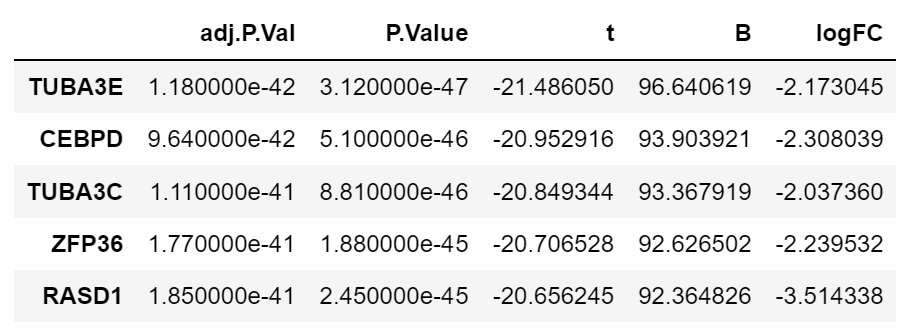
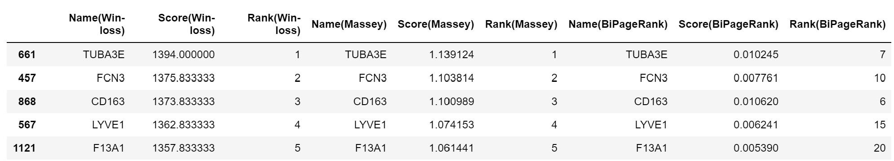

# 🧬 Integration of multiple gene expression with GeneCompete 🏆

GeneCompete is a tool to combine heterogeneous gene expression datasets to order gene importance. Notice that, we suggest using Python function for large datasets.

## Web-Application

https://genecompete.streamlit.app/

## Python function
- Installation
```!git clone https://github.com/panisajan/GeneCompete```
- Load data
```
import pandas as pd
dat1 = pd.read_csv("sample_data/dat1.csv", index_col=0)
dat2 = pd.read_csv("sample_data/dat2.csv", index_col=0)
dat3 = pd.read_csv("sample_data/dat3.csv", index_col=0)
dat4 = pd.read_csv("sample_data/dat4.csv", index_col=0)
dat1.head()
```


- GeneCompete_Union

Input | Description
 ------------ | ------------- 
table | Gene expression data: Multiple files where the first column is gene name. These data can be prepared by any tools.
name | Column name: The interested value that will be used as competing score (in the example is logFC).
method | Ranking Method: Select 'Win-loss', 'Massey', 'Colley', 'Keener', 'Elo', 'Markov', 'PageRank', or 'BiPagerank'
Regulation | Regulation cases: 'Up-regulation' or 'Down-regulation'
FC | logFC threshold: If the union strategy is selected, the number of genes can be large and consume computational time. Before ranking, datasets are filtered with logFC > (logFC threshold) in case of up-regulation and logFC < -(logFC threshold) for down-regulation.

Example 1:
```
from GeneCompete_Union import*

my_data = [dat1, dat3, dat4]
my_methods = ['Win-loss', 'Massey', 'BiPagerank']

score = GeneCompete_Union(table = my_data, name = 'logFC', method = my_methods, reg = 'Down-regulation', FC = 1)
score.head()
```


Example 2:
```
from GeneCompete_Intersect import*

my_data = [dat1, dat2, dat3, dat4]
my_methods = ['Win-loss', 'Keener', 'PageRank']

score = GeneCompete_Intersect(table = my_data, name = 'logFC', method = my_methods, reg = 'Up-regulation', FC = None)
score.head()
```


## Further Reading

This is filler text, please replace this with a explanatory text about further relevant resources for this repo
- Resource 1
- Resource 2
- Resource 3
